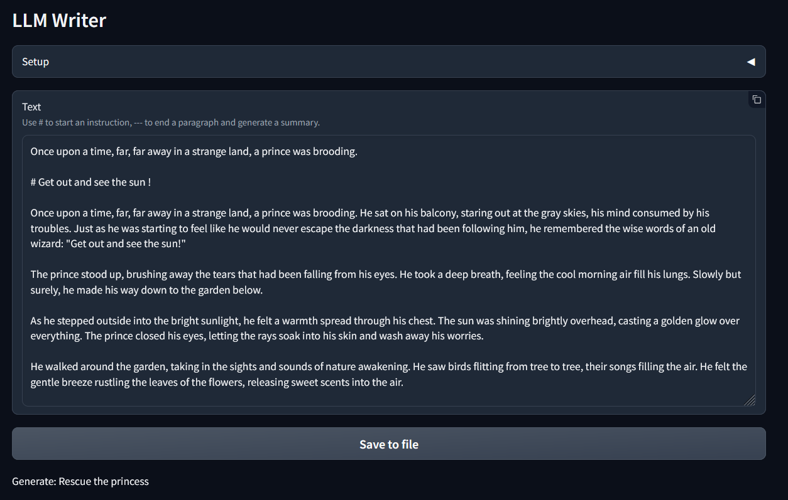

# LLM Writer



## Design

### Usage flow
1. Input an initial context
2. Input an instruction to move the story forward (`#`)
3. Adapt the generated text
4. Generate and review the summary (`---`)
5. Repeat


## Technology
[python](https://www.python.org/)
, [ollama](https://ollama.com/)
, [gradio](https://www.gradio.app/)
, [textual](https://textual.textualize.io/)
  
  
## Install

- Install [ollama](https://ollama.com/)
- Get ollama model (the model can be changed in [ollama.py](./app/ollama.py)):
    ```sh
    ollama serve
    ollama list
    ollama pull llama3
    ```

- Clone
    ```sh
    git clone https://github.com/kyrlian/llm-writer.git
    cd llm-writer
    ```

## Run directly
```sh
uv run llm_writer/textual_cli.py
```

## Install as tool
```sh
uv tool install .
```

Run Text ui (Textual) with `llmwriter`

Web UI (gradio) with `llmwriter_webui`

Start a line with `#` to give instructions, and with `---` to summarize the last paragraph.

## Ressources

- [Simple gradio app to start with ollama](https://www.langchain.ca/blog/chatgpt-clone-with-ollama-gradio/)
- [Install pytorch locally](https://pytorch.org/get-started/locally/)