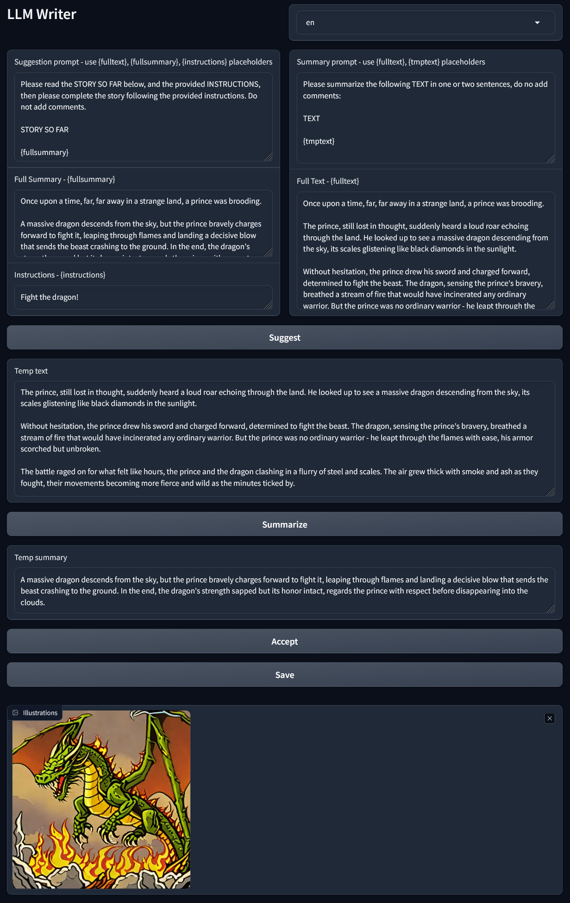

# LLM Writer



## Design
### Inputs/Outputs
1. System instructions for a/ generation and b/ summary (can be edited by user, but shouldn't need to)
2. a/ Full text and b/ summary
3. User instruction to generate new text  
4. a/ Temp text and b/ temp summary for review

### Actions
- Generate : 1a, 2b, 3 => 4a
- Summarize : 1b, 4a => 4b
- Accept text: 2a, 4a => 2a 
- Accept summary: 2b, 4b => 2b

### Usage flow
1. Input an initial context in "Summary"
2. Input an instruction to move the story forward in "Instruction"
3. Suggest new temp text and review
4. Generate new temp summary and review
5. Accept will append temp text and temp summary to text and summary
6. Repeat


## Technology
- [python](https://www.python.org/)
- [gradio](https://www.gradio.app/)
- [ollama](https://ollama.com/)
  
Optional to generate illustrations:
- [sdxl turbo](https://huggingface.co/stabilityai/sdxl-turbo)
- [pytorch](https://pytorch.org/)
  
## Install

- Install [ollama](https://ollama.com/)
- Get ollama model (the model can be changed in [ollama.py](./app/ollama.py)):
    ```sh
    ollama serve
    ollama list
    ollama pull llama3
    ```

- Clone
    ```sh
    git clone https://github.com/kyrlian/llm-writer.git
    cd llm-writer
    ```
- Install requirements

    ```sh
    poetry install
    ```

    or with pip:

    ```sh
    pip install -r requirements.txt --upgrade
    ```

- **Optional**: install sdxl turbo requirements - if sdxl turbo can't be loaded, the image generation will be disabled.:
    ```sh
    pip install -r requirements-sdxlturbo.txt --upgrade
    pip install -r requirements-torch-windows-cuda12.txt --upgrade
    ```

## Run

```sh
poetry shell
python ./llm_writer/app.py
```

## Ressources

- [Simple gradio app to start with ollama](https://www.langchain.ca/blog/chatgpt-clone-with-ollama-gradio/)
- [Install pytorch locally](https://pytorch.org/get-started/locally/)